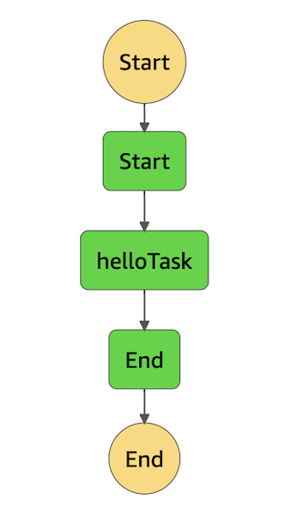
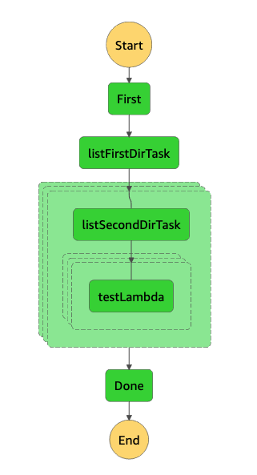

# Serverless Workflow Sample project for AWS

This is AWS CDK with TypeScript and Step Functions and Lambda Sample project.

- Simple Workflow(sfn-simple-state-machine)
    - 3 step workflow with Lambda
    - helloTask is Lambda function



- Advanced WorkFlow(sfn-advanced-state-machine)
    - Create S3 bucket
    - Upload ZIP file(@aws-cdk/aws-s3-deployment)
    - List S3 Bucket(Lambda function)
    - Parallel Lambda Execution(Map State)



## prerequisite

- AWS CLI Setup and Configuration
- Node.js installation
## Usage

Setup

```bash
npm install
```

deploy

```bash
cdk deploy
```

open AWS Step Functions service and you can execute State Machine.

Have fun!

## Useful commands

 * `npm run build`   compile typescript to js
 * `npm run watch`   watch for changes and compile
 * `npm run test`    perform the jest unit tests
 * `cdk deploy`      deploy this stack to your default AWS account/region
 * `cdk diff`        compare deployed stack with current state
 * `cdk synth`       emits the synthesized CloudFormation template
